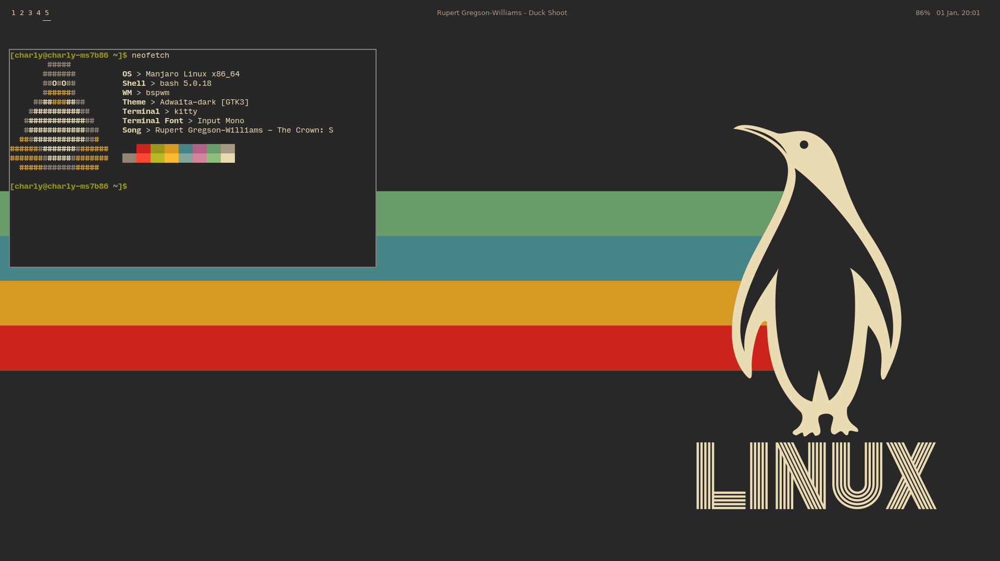
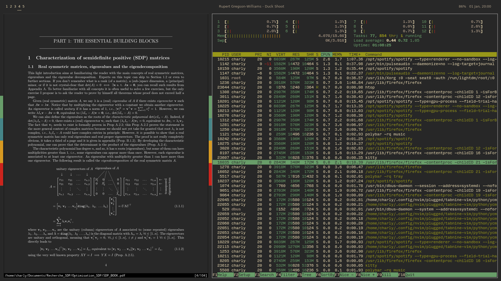
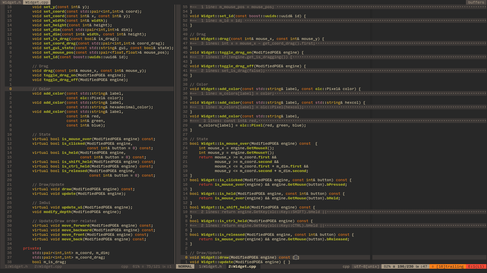

# My personal dotfiles

## Installation

If you want to use my personal config files you'll need to install the packages cited in ***Credits*** and then place the config files in their respective config directories.

## Pictures

## Credits

* [bspwm](https://github.com/baskerville/bspwm)
* [sxhkd](https://github.com/baskerville/sxhkd)
* [Neovim](https://github.com/neovim/neovim) (***I usually use the nightly version, some plugin may not work with the stable version***)
* [kitty](https://sw.kovidgoyal.net/kitty/)
* [fish](https://fishshell.com/)
* [rofi](https://github.com/davatorium/rofi)
* [polybar](https://github.com/polybar/polybar)
* [zathura](https://github.com/pwmt/zathura)
* [Input font](https://input.fontbureau.com/)
* [Fira code font](https://github.com/tonsky/FiraCode)
* [gruvbox](https://github.com/morhetz/gruvbox)

## todo

* [ ] Make a script to automate the configuration on a new machine.
